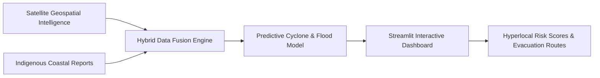

# 🌊 CoastGuard AI — Hybrid Maritime Climate Intelligence System

[](https://www.python.org/)
[](https://streamlit.io/)
[](https://www.tensorflow.org/)
[](https://coastguard-by-krishna-kanhaiya.streamlit.app/)

> **A hybrid climate risk warning engine merging satellite geospatial intelligence with crowdsourced indigenous coastal knowledge.** Computes hyperlocal hazard scores, models storm surges, evaluates mangrove bioshield protection, and generates safe evacuation routes.

---

## 🌐 Live Application
👉 **[Launch CoastGuard AI Web Application](https://coastguard-by-krishna-kanhaiya.streamlit.app/)**

---

## 💡 Hybrid Data Fusion Pipeline



---

## 🧮 Hyperlocal Hazard Risk Equation

$$\text{Risk Score} = \min\left(100, \frac{\text{Wind Speed}}{200} \times 40 + \frac{1013 - \text{Pressure}}{80} \times 35 + \frac{\text{Surge Height}}{5} \times 25\right)$$

---

## 🛠️ Local Developer Setup

```bash
git clone https://github.com/KrishnaKanhaiya1/CoastGuardAI.git
cd CoastGuardAI
pip install -r requirements.txt
streamlit run app_integrated.py
```
