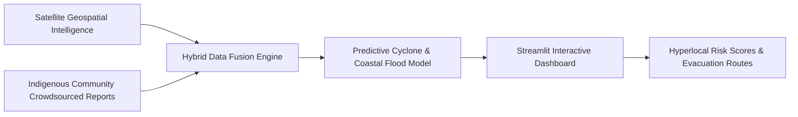

# 🌊 CoastGuard AI — Maritime Early Warning Climate System

[](https://www.python.org/)
[](https://streamlit.io/)
[](https://www.tensorflow.org/)
[](https://coastguard-by-krishna-kanhaiya.streamlit.app/)

> **CoastGuard AI is a hybrid early warning climate intelligence platform that merges satellite geospatial data with crowdsourced indigenous community reports.** Delivers hyperlocal hazard scores, cyclone tracking, bioshield analysis, and automated emergency evacuation routes.

---

## 🌐 Live Application
👉 **[Launch CoastGuard AI Web App](https://coastguard-by-krishna-kanhaiya.streamlit.app/)**

---

## 💡 Data Fusion Architecture



---

## ✨ UI Features & Functionality Inventory

| UI Feature Module | Interactive Functionality | Real User Flow |
| :--- | :--- | :--- |
| **Interactive Satellite Map** | Renders real-time sea surface temperature, mangrove density, and coastal erosion maps. | Toggle geospatial layers $\rightarrow$ Hover over coastal zones to inspect temperature & risk indexes. |
| **Indigenous Community Alert Form** | Allows local fishermen and residents to submit real-time wave/surge reports. | Fill surge observation form $\rightarrow$ Submit report $\rightarrow$ Pins community report on map. |
| **Cyclone Risk Calculator** | Computes hyperlocal hazard scores based on storm trajectory and coastal elevation. | Input wind speed & pressure $\rightarrow$ Click "Assess Hazard Score" $\rightarrow$ View risk meter gauge. |
| **Emergency Evacuation Router** | Calculates shortest safe evacuation paths from hazard zones to storm shelters. | Select starting district $\rightarrow$ Click "Generate Evacuation Route" $\rightarrow$ Displays step-by-step route map. |

---

## 🛠️ Local Developer Setup

```bash
git clone https://github.com/KrishnaKanhaiya1/CoastGuardAI.git
cd CoastGuardAI
pip install -r requirements.txt
streamlit run app_integrated.py
```
