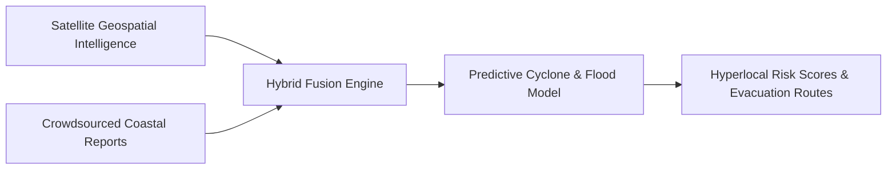

# CoastGuard AI — Maritime Early Warning System

[](https://github.com/KrishnaKanhaiya1/CoastGuardAI/actions/workflows/ci.yml)
[](https://coastguard-by-krishna-kanhaiya.streamlit.app/)
[](https://www.python.org/)
[](https://streamlit.io/)
[](https://www.tensorflow.org/)

CoastGuard AI is a hybrid early warning climate platform that merges satellite geospatial data (vegetation index, sea surface temperature, cyclone track models) with crowdsourced indigenous community reports to output hyperlocal hazard scores and evacuation routes.

---

## 🌐 Live Application
👉 **[Open Live Streamlit Application](https://coastguard-by-krishna-kanhaiya.streamlit.app/)**

---

## ⚙️ Data Fusion Architecture



---

## 🛠️ Local Execution

```bash
git clone https://github.com/KrishnaKanhaiya1/CoastGuardAI.git
cd CoastGuardAI
pip install -r requirements.txt
streamlit run app_integrated.py
```
