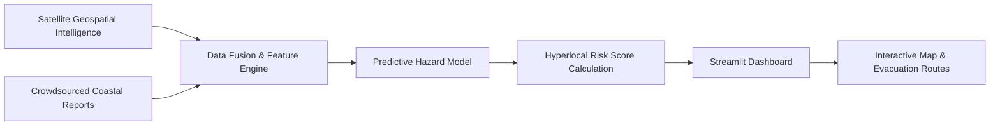

# CoastGuard AI — Maritime Early Warning Climate System

[](https://coastguard-by-krishna-kanhaiya.streamlit.app/)
[](https://www.python.org/)
[](https://streamlit.io/)
[](https://www.tensorflow.org/)
[](LICENSE)

A hybrid climate intelligence and early warning platform designed to safeguard coastal communities. **CoastGuard AI** merges quantitative satellite geospatial data with qualitative crowdsourced indigenous community knowledge to compute hyperlocal hazard scores, predict storm surges, and generate safe evacuation routes.

[🚀 Explore Live Application](https://coastguard-by-krishna-kanhaiya.streamlit.app/) • [📖 View Architecture](#-hybrid-data-fusion) • [⚡ Local Setup](#-getting-started)

---

## 📌 Executive Overview

Coastal regions face increasing risks from cyclones, sea-level rise, and sudden flooding. Existing regional weather alerts often lack hyperlocal precision and ignore ground-level observations from local fishing communities.

**CoastGuard AI** addresses this gap by fusing satellite data (Sea Surface Temperature, Vegetation Index, Pressure anomalies) with real-time community surge reports, delivering actionable risk scores and automated evacuation routing.

---

## 🏗️ Hybrid Data Fusion



---

## ✨ Key Feature Modules

### 🛰️ Geospatial Risk Mapping
* **Satellite Data Layers**: Visualizes sea surface temperature variations, coastal vegetation density, and cyclone track forecasts.
* **Hyperlocal Risk Gauge**: Computes dynamic hazard indexes (Low, Moderate, High, Extreme Danger) based on barometric pressure and wind speeds.

### 👥 Community Alert Network
* **Crowdsourced Report Submission**: Enables local residents and coastal authorities to submit ground observations (wave height, unusual sea behavior).
* **Map Verification**: Displays crowdsourced alerts alongside satellite layers for multi-source verification.

### 🚗 Emergency Evacuation Router
* **Route Generation**: Calculates safe evacuation paths from high-risk coastal sectors to designated storm shelters.

---

## 🚀 Getting Started

### Prerequisites
* **Python**: `v3.10` or higher

### Installation & Run Commands
```bash
# Clone repository
git clone https://github.com/KrishnaKanhaiya1/CoastGuardAI.git
cd CoastGuardAI

# Install requirements
pip install -r requirements.txt

# Run Streamlit application
streamlit run app_integrated.py
```

---

## 📄 License

This project is licensed under the MIT License - see the [LICENSE](LICENSE) file for details.
